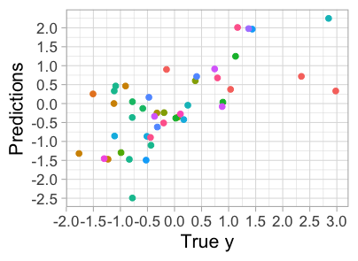

**Author:** [Bruna Wundervald](http://brunaw.com/) **License:** [MIT](https://opensource.org/licenses/MIT)<br/>

  [](https://cran.r-project.org/package=hebart) [](https://cran.r-project.org/package=hebart) [](http://www.rdocumentation.org/packages/hebart) [](https://travis-ci.org/brunaw/hebart)


`hebart`: A package for fitting of Hierachical Embedded Bayesian Additive Regression Trees, which is an extension of BART to grouped data. 
========================================

hebart description goes here

  Installation
------------------------


You can currently install the latest version of `hebart` from the github repository with:
  ``` r
# install.packages("devtools")
devtools::install_github("brunaw-hebart")
```

This package wil soon be on CRAN; 

``` r
install.packages("hebart")
```

Functionalities
------------------------


All of the functions and documentation can be found with:

``` r
library(hebart)
packageVersion("hebart")
ls("package:hebart")
help(package = "hebart")
```

Examples 
------------------------

``` r
#----------------------------------------------------
# Package loading  ----------------------------------
library(magrittr)
library(ggplot2)
library(tidymodels)
library(hebart)

# Dataset split  ------------------------------------
df_real     <- lme4::sleepstudy %>% set_names(c('y', 'X1', 'group'))
df_real$y   <- c(scale(df_real$y))
data_split  <- initial_split(df_real)
train       <- training(data_split)
test        <- testing(data_split)

# Model parameters -----------------------------------
group_variable <-  "group"
formula        <- y ~ X1
pars           <- list(
  k1 = 8, k2 = 5, alpha = 0.5, beta = 1, mu_mu = 0
)

# Running the model ----------------------------------
hb_model <- hebart(formula,
                   dataset = train,
                   iter = 100, burn_in = 25, 
                   P = 20, group_variable, pars,
                   min_u = 0, max_u = 20, scale = FALSE)

# Making predictions ----------------------------------
pred_test <- predict_hebart(
  hb_model, newdata = test, 
  group_variable = group_variable, formula = formula
)

# Plotting results  ----------------------------------
data.frame(
  y = test$y, pred = pred_test$pred, 
  group = pred_test$group, pred_lme = pred_lme
)  %>% 
  ggplot(aes(x = y, y = pred)) +
  geom_point(aes(colour = factor(group)), size = 2) +
  labs(x = "True y", y = "Predictions") +
  theme_light(16) +
  scale_y_continuous(breaks = scales::pretty_breaks(n = 10)) +
  scale_x_continuous(breaks = scales::pretty_breaks(n = 10)) +
  guides(colour = "none")
#----------------------------------------------------
#----------------------------------------------------
```



To be implemented
------------------------


- [ ] The official `pkgdown` for `hebart`
- [ ] Variable importances
- [ ] Diagnostics


Citation
------------------------

To cite this package in publications, please use:

```
Bruna Wundervald (2022). hebart: Hierachical Embedded Bayesian Additive Regression Trees. R package version 0.1.0.
https://CRAN.R-project.org/package=hebart 
```

A BibTeX entry for LaTeX users is

```
@Manual{,
  title = {hebart: Hierachical Embedded Bayesian Additive Regression Trees},
  author = {Bruna Wundervald},
  year = {2022},
  note = {R package version 0.1.0},
  url = {https://CRAN.R-project.org/package=hebart},
}
```

This citation format can be obtained at any moment in `R` with:

  ``` r
citation('hebart')
```

Contributing
------------------------

  Contributions to this project are always highly incentivized. To do
so, please be aware that `git` is our main tool for version control.
The minimal steps for a contribution are:

  1. Fork this repository into your `GitHub` account and clone it
the way you prefer.
2. Do the changes, making sure everything is well documented,
examples are provided and checking if the package still correctly builds.
3. Push your changes to `git` and create a new pull request in
`GitHub`, explaining why and what are the changes made.
4. Done! Wait for review & acceptance of the pull request :)

To contributors who are new to writing R packages, we recommend
the ['R Packages' book](http://r-pkgs.had.co.nz/), by Hadley
Wickham. To those who are new to `git`/`GitHub`, we recommend
[this tutorial](http://brunaw.com/talk/git/). Many contributing
resources to open source projects can be found at
[this repository](https://github.com/freeCodeCamp/how-to-contribute-to-open-source).


